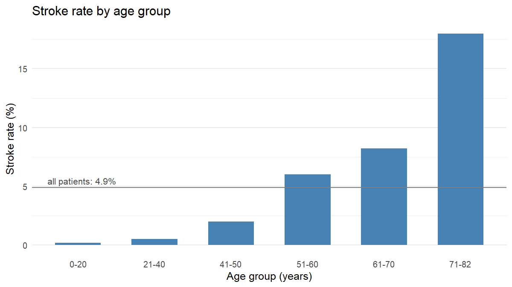
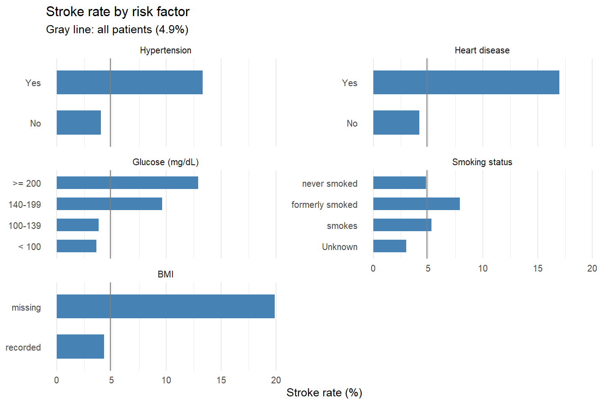
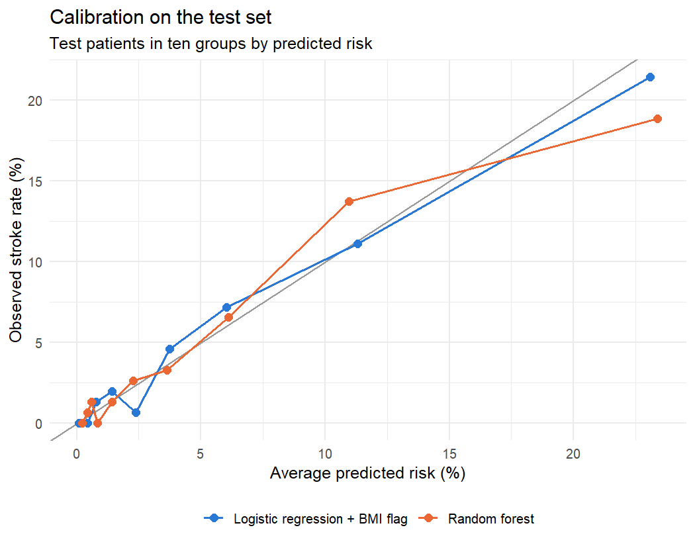

# Predicting Stroke from Health Data

An R project on the [Kaggle stroke dataset](https://www.kaggle.com/datasets/fedesoriano/stroke-prediction-dataset) (5,109 patients). I look at which factors go together with stroke, build a logistic regression, and compare it with LDA and a random forest.

The outcome is rare: only 4.9% of the patients had a stroke. A logistic regression with the default 0.5 threshold is 95% accurate on the test set and still misses every single stroke patient, so a good part of the project is about handling that properly.

📄 **[Full report (HTML)](https://mbalazs03.github.io/stroke-risk-analysis/stroke_risk_analysis.html)**



## What I did

- **Data preparation:** converted BMI from text, dropped one patient with gender "Other", and imputed missing BMI with the training set median after the split
- **Exploratory analysis:** stroke rates by age, hypertension, heart disease, glucose level, smoking status and missing BMI
- **Threshold tuning:** chose the decision threshold from out-of-fold predictions on the training data instead of using 0.5, and also looked at a threshold aimed at 80% recall for screening
- **Feature engineering:** tested a missing-BMI indicator and a squared age term with likelihood-ratio tests (the indicator helped, the squared term did not)
- **Models:** logistic regression, LDA and a random forest (`ranger`), all with the same features, folds and threshold search
- **Evaluation:** ROC-AUC, PR-AUC, Brier score, calibration, precision/recall/F1, and 10 × 5 repeated nested cross-validation with a corrected paired t-test to compare the models



## Results

- Age is the strongest factor: the stroke rate goes from 0.2% under 20 to 18% between 71 and 82, and each extra year multiplies the odds of stroke by about 1.07.
- Patients without a recorded BMI have about 4.6 times higher odds of stroke, even after adjusting for age and the other variables. Adding this as a feature improved the logistic regression (likelihood-ratio test p < 0.001, and a higher AUC in 49 of 50 cross-validation folds).
- With a 0.5 threshold the base model finds 0 of the 74 stroke patients in the test set; with a tuned threshold of 0.13 it finds 38. A screening threshold aimed at 80% recall catches 84% of them but flags a third of all patients.
- In repeated cross-validation the models end up close:

| Model | ROC-AUC | PR-AUC | Brier | Recall | Precision | F1 |
|---|---|---|---|---|---|---|
| Logistic regression (base) | 0.841 | 0.192 | 0.043 | 0.535 | 0.181 | 0.269 |
| Logistic regression + BMI flag | 0.850 | 0.215 | 0.042 | 0.483 | 0.208 | 0.287 |
| LDA | 0.841 | 0.199 | 0.047 | 0.450 | 0.204 | 0.278 |
| Random forest | 0.839 | 0.217 | 0.042 | 0.476 | 0.197 | 0.274 |

*Means over 50 folds. A random model would get a PR-AUC of about 0.05.*

None of the differences between the logistic regression with the BMI flag and LDA or the random forest are statistically significant, so I'd go with the logistic regression: it's as good as the others, well calibrated, and easy to explain.



## Limitations

- The data is observational, so these are associations, not causes. I can only guess why a missing BMI is linked to stroke.
- Precision stays around 20% with the F1 threshold. At best this could be a first screening step.
- The random forest isn't tuned, and there's no second dataset to validate on.

## Running it

1. Install R and the packages:

   ```r
   install.packages(c("rmarkdown", "caret", "pROC", "PRROC", "ranger", "ggplot2", "corrplot"))
   ```

   `MASS` comes with R.

2. Download `healthcare-dataset-stroke-data.csv` from [Kaggle](https://www.kaggle.com/datasets/fedesoriano/stroke-prediction-dataset) and put it in the `data/` folder.

3. Render the report (the cross-validation part takes a few minutes):

   ```r
   rmarkdown::render("stroke_risk_analysis.Rmd")
   ```

## Files

```
stroke_risk_analysis.Rmd    analysis code and text
stroke_risk_analysis.html   rendered report
figures/                    charts used in this README (saved by the Rmd)
data/                       put the Kaggle CSV here
```
